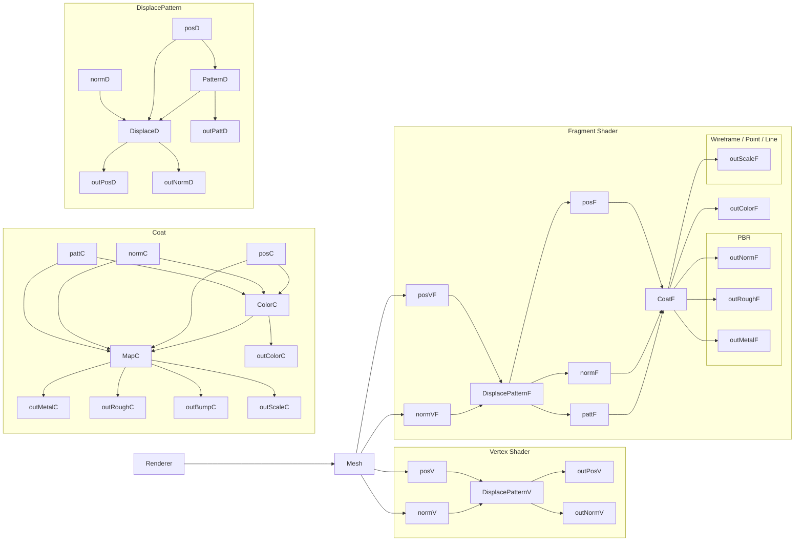

```mermaid
graph LR;


    subgraph Coat
        posC-->ColorC;
        normC-->ColorC;
        pattC-->ColorC;

        ColorC-->MapC;
        posC-->MapC;
        normC-->MapC;
        pattC-->MapC;

        MapC-->outMetalC;
        MapC-->outRoughC;
        MapC-->outBumpC;
        MapC-->outScaleC;
        ColorC-->outColorC;

        


    end

    subgraph DisplacePattern
        posD --> PatternD;
        normD --> DisplaceD;
        posD --> DisplaceD;
        PatternD --> outPattD;
        PatternD --> DisplaceD;
        DisplaceD --> outPosD;
        DisplaceD --> outNormD;
    end

    Renderer-->Mesh;
    Mesh-->posV;
    Mesh-->normV;

    subgraph Vertex Shader
        posV-->DisplacePatternV;
        normV-->DisplacePatternV;
        DisplacePatternV-->outPosV;
        DisplacePatternV-->outNormV;
    end

    Mesh-->posVF;
    Mesh-->normVF;

    subgraph Fragment Shader
        posVF-->DisplacePatternF;
        normVF-->DisplacePatternF;
        DisplacePatternF-->posF;
        DisplacePatternF-->normF;
        DisplacePatternF-->pattF;
        posF-->CoatF;
        normF-->CoatF;
        pattF-->CoatF;
        CoatF-->outNormF;
        CoatF-->outColorF;
        CoatF-->outRoughF;
        CoatF-->outMetalF;
        CoatF-->outScaleF;
        subgraph PBR
            outNormF;
            outRoughF;
            outMetalF;
        end
        subgraph Wireframe / Point / Line
            outScaleF;
        end
    end


```
